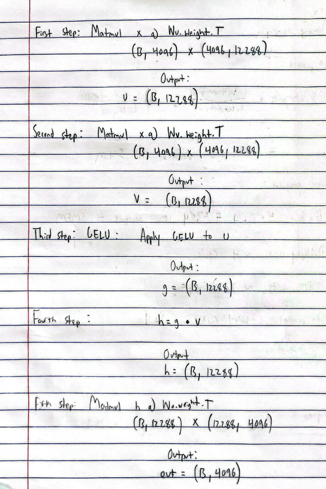
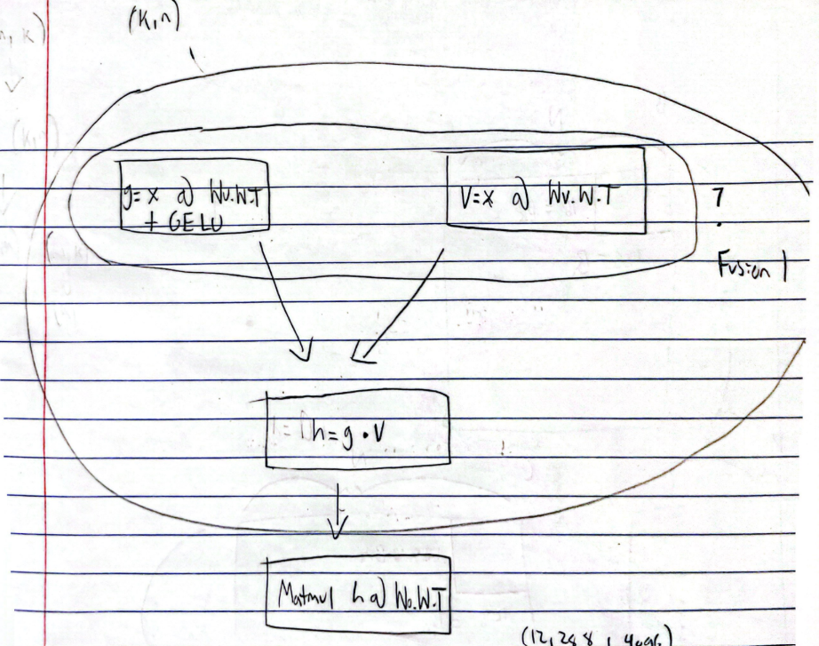

This project attempts to write a CUDA Kernel for the GEGLU_FFN operation:

```
    def __init__(self, hidden_size=4096, intermediate_size=12288):
        super().__init__()
        self.Wu = nn.Linear(hidden_size, intermediate_size, bias=False)
        self.Wv = nn.Linear(hidden_size, intermediate_size, bias=False)
        self.Wo = nn.Linear(intermediate_size, hidden_size, bias=False)

    def forward(self, x):
        u = self.Wu(x)      # (B, 12288)
        v = self.Wv(x)      # (B, 12288)
        g = F.gelu(u)
        h = g * v
        return self.Wo(h)   # (B, 4096)
```

When I first started this project, I wanted to see what exactly the Pytorch implementation
was doing. To do this, I profiled the Pytorch forward call and then analyzed what kernels
were running. One thing I was curious about was whether it was using CUDA cores or Tensor cores,
which could result in a drastic performance difference. I was also curious about how PyTorch was
splitting the operations and how they were sequenced. This way I could determine based on the
profiler times what the bottleneck was. This is why I created the file `ffn_profiled.py`, which I
ran with the command `ncu --target-processes all python ffn.py`. This generated a report that I
delved into deeper. I found three instances of the
"ampere_sgemm_128x64_tn" kernel running, as well as a "vectorized_elementwise_kernel". I found
that the matrix multiply was taking the most time. I also found that the elementwise multiplication
kernel was taking very little time and there were also other operations like the transpose and gelu
that were taking marginal time. I originally thought that PyTorch was taking the transpose of the
weight matrices from the linear layers, but I later found out that the transpose operation was just
for "book keeping" and never actually moved any data elements around or did any data manipulation.
Instead, PyTorch just smartly told cuBLAS to view the input matrix as transposed by passing a
transpose flag. This analysis of the profiled PyTorch code was useful in one major way. It
demonstrated that the PyTorch code was splitting the three linear layer computations into
three separate kernel calls. It also was applying the GELU operation separately and performing
the elementwise multiplication separately. To better understand the operations that are
required for GEGLU_FFN, I listed each of the steps involved in the computation:



One important realization from this was that steps 1-4 produce the same output shape. This might
make it easier to merge some combination of these steps into one kernel where the threads work 
on the same block tiles across these different stages.

Furthermore, I realized that some steps, like step 1 and step 2, were independent and could be 
performed simultaneously while others like the fourth step dependended on the g and v results from the
previous steps. To model these dependencies, I created a graph:



I decided that the GELU could be easily fused with the computation of g since it is an elementwise
operation that can just be added to the end of each element computation in g. Similarly, I noticed
that g and v could be horizontally fused since these computations do not depend on each other.
The same first operand x might also make it easy to tile over x in the fused kernel and reuse its
shared memory across both Wu and Wv. Then I noticed that h, which just computes the elementwise product
of g and v could also be fused into this kernel since once g and v are computed it just needs to multiply
the corresponding elements. This gave me the idea to fuse the computation of g, v, and h into one kernel.
Then I could perform the final stage of multiplying h with Wo.W.T at the very end. The reasoning for this
kernel fusion approach was that I would be loading X, Wu, and Wv from memory once. basically I could load
tiles from GMEM for X once and then store into a shared memory tile that is used for both Wu and Wv. This
not only prevents relaunching separate kernels for Wv and h (and the overhead associated with that), but
also prevents accessing X's GMEM more than once. Another good property I noticed was that since Wu and Wv
are of the same size, I could basically just block tile across both simultaneously in the vertical direction.
This might also increase ILP (instruction-level parallelism) since there would be duplicate operations for
loading into the WuS and WvS shared memory tiles and performing the same similar computations. The one
disadvantage I foresaw with this approach would be that I would be putting register and shared memory
pressure on the threads. I would not only be storing the Wu SMEM tile but also the Wv SMEM tile. On top of
that I would be storing separate outer product registers for the N direction (one for Wu and one for Wv).
I could reuse the M direction registers from X since that would be the same for X. But overall the register
and shared memory usage would be higher. I figured that if I tuned the tiling settings, I might be able to
migitate the thread pressure. Overall though, this fused approach would be making less GMEM calls
and performing more operations from the fusion, so I predicted this would increase the arithmetic intensity.
So I decided to start writing the kernel. I decided to follow the structure of Aleksa Gordic's kernel from: 
https://www.aleksagordic.com/blog/matmul. I did not realize it at the time, but this kernel appears to work
best for square like matrices. In this GEGLU_FFN, however, the dimensions along some axes are disproportionately
small. For example, the shape (B, 4096) for X has much fewer rows than columns. Although I later figured it out,
in these small batch size cases, cuBLAS redirects the matrix multiplication to specialized kernels like 
gemmsn_nn_kernel. I did not realize this shape issue at the time and decided to go with the block tile approach.
Before I started the block tile kernel, I realized one critical issue. The weights are stored in the shape 
(12288, 4096) shape but need to be transposed before they are multiplied with X. This key issue led me to consider
three different options:

1. I could transpose the weight matrices on the CPU and then pass them to the GPU in the correct format
2. I could create a separate kernel to transpose the matrices and then copy them back to the host and then
   pass them into the fusion kernel (basically just a preinitialization step)
3. I could use an approach similar to cuBLAS and just pass the matrices in transposed but just read them differently
   in the kernel. This would affect the memory access patterns though

I decided to not go with approach 1 because these weight matrices are rather large and tranposing them on the CPU
seems like a waste of time. Approach 2 would probably work too but I was concerned about the additional writes to
GMEM to save the transposed matrix which could be expensive. Furthermore launching another kernel just for a transpose
seemed excessive. Approach 3 seemed reasonable, but I wanted to gauge the impact of reading the memory "sideways" due 
to the transposed layout. This led me to some interesting tangent tests that I wanted to examine. First, since we 
would be reading GMEM blocks from B horizontally instead of vertically, and also since these blocks would be 
transposed and shape (Bn, Bk) instead of (Bk, Bn), I was curious to see how this would affect coalescing. Since Bk is
usually smaller than Bn, the number of contiguous memory locations on each row of the block S would be smaller, meaning
that the number contiguous memory transactions would be smaller. Therefore, the coalescing might be impacted by this
transpose. Another thing I noticed is that when we are copying the A block into As, we read this way too. But for this
copy to As, we make each thread read four floats instead of just one. This means that threads in one warp will move to
the next row quicker. I was curious if this might be worse than just making each thread read one float but then 
more threads read from one contiguous row in A. Basically I wanted to compare whether vectorization or more coalescing
results in better performance. To test this, I created the `simple_test_warp_tiled_csc.cu` file where I replaced the
loading of blocks from A into As with each thread only loading one element but all consecutive threads reading raster-wise
across the block in A. Basically I was comparing these two different approaches:

Vectorized:

(Row 0 of A):
Thread 0: Load floats 0-3
Thread 1: Load floats 4-7
Thread 2: Load floats 8-11
Thread 3: Load floats 12-15

(Row 1 of A):
Thread 4: Load floats 4096-4099
Thread 5: Load floats 4100-4103
Thread 6: Load floats 4104-4107
Thread 7: Load floats 4108-4111

...

Compared to more granular coalescing which might result in fewer transactions per warp:

(Row 0 of A):
Thread 0: Loads float 0
Thread 1: Loads float 1
Thread 2: Loads float 2
...
Thread 15: Loads float 15

(Row 1 of A):
Thread 16: Loads float 4096
Thread 17: Loads float 4097
Thread 18: Loads float 4098
...

I surprisingly found that the original vectorized version ends up being faster. So I decided
to copy the tile from B to Bs by making each thread load four floats. This basically means
that copying the tile from B to Bs needs to be changed to the same approach as copying A
to As. We need to read memory from B (which is transposed) and then "untranspose" it by
writing it into the SMEM Bs transposed. However, this means that we read from GMEM horizontally
using the vectorized loads but then store into the SMEM Bs tile vertically. Since we are storing
vertically, we get bank conflicts just like we do for A. I could not figure out a way to mitigate
this problem, so I just decided to leave it since bank conflicts seem less critical than reading
from GMEM vertically. One final thing I was curious about was whether instead of computing the
outer product using the register values in regM and regN, I used regM and regN to compute dot
products instead. For example, I could slide regM across the M dimension for each element
in threadResults and likewise for regN, which would compute partial dot products. I could
then accunulate those partial dot products into threadRegs. However, I did some calculations
and found that this approach results in far more accesses to the SMEM tiles for A and B compared
to the outer product approach, so I did not go with this approach.

After these two conclusions, my implementation plan was as follows: Implement a matrix multiply
based on Aleksa's kernel, but just account for the fact that B is passed in transposed.
I would just need to read the tiles from the B matrix horizontally instead of
vertically, and then transpose when writing to the SMEM Bs tile so that it appears "normal" for
the rest of the algorithm. So I implemented this approach in the `simple_test_warp_tiled.cu` file.
This kernel ended up working, so I had the backbone for my steps 1-4 fusion kernel. I decided to
write the fusion kernel in the file `fused_ffn.cuh`. Here I take the X matrix, Wu matrix, and Wv matrix
as input and compute X @ Wu.W.T and W @ Wv.W.T simultaneously. I also realized that I do not need to 
save to the intermediate matrices g and v in GMEM at all and can get rid of them entirely. I decided to
write directly to the output matrix h, reducing GMEM writes. I also got rid of the alpha and beta parameters
used in the traditional GEMM algorithm and just multiplied the matrices directly. This meant that I could
also vectorize the store to the output matrix h. I tested this kernel for correctness in the `test_fused_ffn.cu`
file which computes steps 1-4 on the CPU and compares it to the kernel result. I found that it passed the 
correctness test. After this point, I had all the components I needed to write the full GEGLU_FFN kernel.
I had a kernel for steps 1-4 in `fused_ffn.cuh` and a matrix multiplication kernel for two matrices in 
`sgemm_warp_tiling_bt.cuh` for step 5 where I multiply h @ Wo.W.T. I decided to take both of these kernels
and write driver code that runs the full pipeline for different batch sizes and times them just like `ffn.py`
does. This code is in `ffn_runner.cu`. After running this file, I got the following results:

Device: CUDA
Batch   4: 2.972 ms
Batch   8: 2.998 ms
Batch  16: 2.998 ms
Batch  32: 2.974 ms
Batch  64: 11.317 ms
Batch 128: 8.680 ms

The Pytorch code yields the following in comparison:

Device: cuda
Device: cuda
Batch   4: 2.657 ms
Batch   8: 2.741 ms
Batch  16: 2.741 ms
Batch  32: 3.007 ms
Batch  64: 3.279 ms
Batch 128: 6.542 ms

These are not great results. The only time my code performs better is for batch size 32. I suspect that there
are some issues with my tiling configurations based on batch size. I do not currently change the parameters
too much depending on the batch size, which could be causing some issues with compute and memory throughput.
For example, I used Nsight compute to profile the batch size B = 4, and I found the message:
"This kernel grid is too small to fill the available resources on this device, resulting in only 0.3 full waves across all SMs."
I may need to make the block size a bit smaller to increase the grid size. This requires fiddling with the 
launch parameters, but these have a strict search space due to the many modulo requirements, etc. I plan to
tune these parameters to see if I can get further performance. Another thing I aim to do is change the kernel
based on the batch size. For smaller batch sizes like B = 4, the X matrix will be of shape (4, 4096) in which case the
As might not even need to be stored in shared memory and might be better stored directly into registers if Bk is low enough.
These kind of highly specialized kernels might improve performance further if I can redirect which kernel runs
based on the input matrix sizes. This kind of "smart" redirection appears to be what cuBLAS is doing.